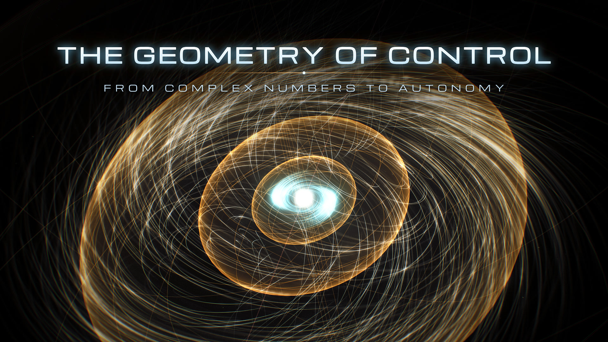

# The Geometry of Control

**English** · [中文](README_zh.md)

[](YOUTUBE_URL)

▶ Watch: [YouTube](YOUTUBE_URL) · [Bilibili](BILIBILI_URL)

*Everything unstable eventually falls. Unless it can sense its own error.*

A 3½-minute short film about control theory: how a steam engine learned to hold its speed, how a rocket lands upright, how a swarm of drones finds order without a leader. There is no video, image or audio file anywhere in it. Every frame and every note is generated by code, live in your browser, and the whole film is a single `index.html`.

> Co-created and fully implemented by Claude Opus 5.5 under human direction.

## Watch it in your browser

Download `index.html`, open it in Chrome or Edge on a desktop, give it about 25 seconds to compose the music, then press play.

- `Space` play / pause · `←` `→` skip · `0`–`9` jump between chapters · `H` hide the data panels · `F` fullscreen · `M` mute
- Runs at a full 60 fps on an RTX 4060, with the odd hiccup when a heavy scene starts. On a slower machine, add `?q=low` to the address.

## What's in it

A pen balanced on its tip falls over. The rest of the film is about how to make it stand.

- **I · The Imaginary Dimension**: every oscillation is secretly a rotation, and a whole signal collapses into a single point.
- **II · State Space**: Watt's steam governor wobbles, Maxwell explains why, and Lorenz stumbles onto chaos.
- **III · Feedback**: sense the error, push back. The falling pendulum gets caught, and Apollo 11 is guided down to the Moon.
- **IV · Autonomy**: a rocket booster lands upright, and drones organise themselves with no commander.

## Small things to look for

- **One villain.** A single number, s = +2, is the troublemaker of the whole film. It makes the pen fall, tears space apart and knocks the pendulum over, and it makes a last stand in the finale.
- **You can hear the maths.** The sweeping tone over the landscape in Act I follows the same curve you see on screen, and the big brass chord lands on the exact frame the pendulum is caught.
- **Nothing is hand-animated.** The steam governor, the pendulum and the rocket are real simulations. The film just points a camera at them.
- **Chaos from a typo.** The two chaotic racers start 0.000127 apart: the digits Lorenz dropped when he retyped a number and discovered chaos.
- **Control on the beat.** The rocket re-plans its landing on every sixteenth note of the music.
- **A title that settles.** In the finale 15,000 particles steer themselves into the title, overshoot a little and settle, the way a real controller does.
- **The cover is from the film**, shot like a long-exposure photo.

## For developers

Needs Node 22 or newer, Chrome or Edge, and Python 3 (on Windows, run the `.sh` scripts in Git Bash).

```bash
bash tools/fetch_fonts.sh && bash tools/fetch_vendor.sh   # download the source fonts
python -m venv .venv && .venv/Scripts/pip install -r requirements.txt   # .venv/bin/pip on macOS / Linux
node tools/build.mjs                          # src/ → index.html
node tools/test_math.mjs                      # check the maths
node tools/export.mjs --w 2560 --sub 4        # render the film to MP4
node tools/cover.mjs --yt                     # render the cover (without --yt: the Bilibili version)
```

The film lives in `src/js/` as numbered files that `build.mjs` joins in order: engine first, then music, then one scene after another. `tools/test_math.mjs` runs 41 checks that the physics on screen is right. So far it has only been tested on Windows.

## License

Code under the [MIT License](LICENSE). The bundled three.js and fonts keep their own open licenses (two fonts are renamed, as their license requires). See [LICENSES/](LICENSES/).
